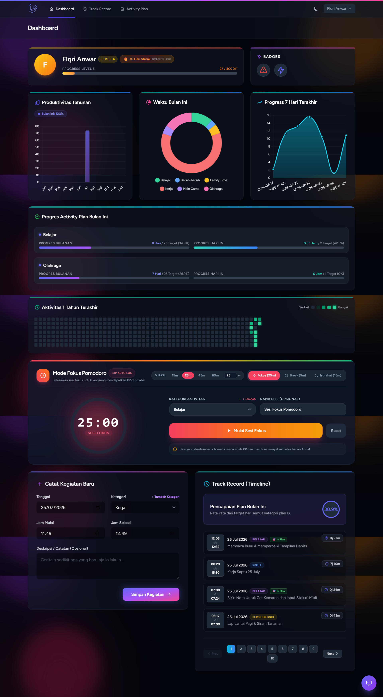
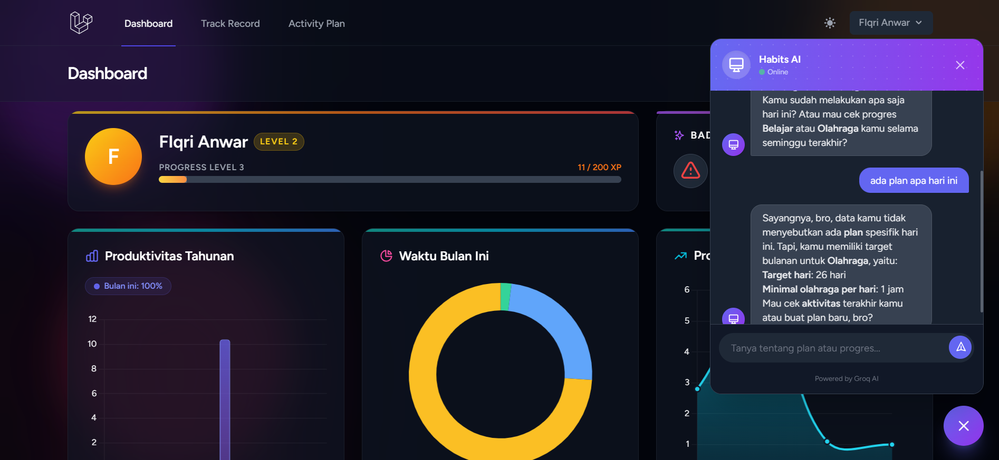

<div align="center">
  <br>
  <h1>Habits Tracker + Gamification 🏆</h1>
  <p>
    <strong>Aplikasi pelacak kebiasaan (Habit Tracker) berbasis gamifikasi modern untuk meningkatkan produktivitas harian.</strong>
  </p>
</div>

---

## 📖 Deskripsi Singkat

**Habits Tracker** adalah aplikasi berbasis web yang membantu pengguna melacak kebiasaan harian dan tugas-tugas penting dengan pendekatan *gamifikasi*. Setiap tugas atau sesi fokus yang diselesaikan akan memberikan **Experience Points (XP)** kepada pengguna, memungkinkan mereka naik level, mengumpulkan **Badge** pencapaian, dan mempertahankan **Habit Streak (🔥)** harian. Aplikasi ini dirancang agar produktivitas terasa menyenangkan dan nagih!

---

## 🌟 Daftar Fitur Unggulan

- 🍅 **Mode Fokus Pomodoro Interaktif:** Timer fokus (25m Focus, 5m Short Break, 15m Long Break) interaktif dengan auto-log kegiatan & pencatatan XP otomatis.
- 🔥 **Habit Streak Counter:** Lacak rekor konsistensi harian (*Current Streak* vs *Best Streak*) dengan indikator api interaktif.
- 🎉 **Gamifikasi Audio-Visual & Leveling:** Sistem XP, efek suara *synth victory chime*, dan efek ledakan *confetti* perayaan saat menyelesaikan habit/naik level.
- 🏆 **Koleksi Badge (Lencana Pencapaian):** Dapatkan badge bergengsi secara otomatis seiring meningkatnya produktivitas kamu.
- 🤖 **AI Chatbot Widget:** Asisten cerdas berbasis AI bawaan yang siap memberikan motivasi, saran kebiasaan, dan bantuan kapan saja.
- 📊 **Dashboard & Heatmap Kontribusi:** Grafik statistik produktivitas harian/tahunan serta *contribution heatmap* (ala GitHub) 365 hari terakhir.
- 🎯 **Target & Plan Kategori:** Tetapkan dan evaluasi target hari & jam minimal harian per kategori aktivitas (Belajar, Pekerjaan, Kesehatan, dll).
- 📝 **Track Record & Riwayat Aktivitas:** Filter, pencarian, dan pagination lengkap untuk meninjau kembali seluruh riwayat kegiatan.

---

## 📸 Tangkapan Layar (Screenshots)

### 1. Halaman Dashboard & Gamifikasi

*Menampilkan statistik produktivitas, Pomodoro timer, progress XP, level pengguna, streak counter, dan target kategori.*

### 2. AI Chatbot Widget

*Widget asisten cerdas yang memberikan motivasi dan saran harian.*

---

## 🚀 Langkah Instalasi

Ikuti langkah-langkah berikut untuk menjalankan aplikasi ini secara lokal di mesin Anda.

1. **Clone repository ini**
   ```bash
   git clone https://github.com/fiqrianwar1/habits-tracker.git
   cd habits-tracker
   ```

2. **Install dependensi PHP (Composer)**
   ```bash
   composer install
   ```

3. **Install dependensi Frontend (NPM) & Build Assets**
   ```bash
   npm install
   npm run build
   ```

4. **Siapkan berkas Environment**
   Salin `.env.example` menjadi `.env`.
   ```bash
   cp .env.example .env
   ```

5. **Generate Application Key**
   ```bash
   php artisan key:generate
   ```

6. **Konfigurasi Database**
   Secara default, aplikasi menggunakan SQLite. Jalankan migrasi dan seeder:
   ```bash
   php artisan migrate --seed
   ```

7. **Jalankan Development Server**
   ```bash
   php artisan serve
   ```
   *Buka `http://localhost:8000` atau via Laravel Herd (`http://habits.test`) di browser Anda.*

---

## 🧪 Cara Menjalankan Test

### PHPUnit (Unit & Feature Tests)
Untuk menjalankan tes backend bawaan Laravel:
```bash
php artisan test
```

### Playwright (End-to-End Tests)
Aplikasi ini mendukung E2E testing menggunakan Playwright untuk mensimulasikan interaksi pengguna di browser.
```bash
npm init playwright@latest
npx playwright test
```

---

## 🛠 Tumpukan Teknologi (Tech Stack)

<p align="center">
  
</p>

- **Backend:** Laravel 11 (PHP 8.2+)
- **Frontend:** Laravel Livewire 3, Alpine.js & Chart.js
- **Styling:** Tailwind CSS (Custom Dark Mode & Glassmorphism)
- **Database:** SQLite / MySQL
- **Audio & Visual:** Web Audio API Synth & Canvas-Confetti
- **Testing:** PHPUnit & Playwright (E2E)

---

<p align="center">
   Dibuat dengan ❤️ untuk membantu membangun kebiasaan yang lebih baik.<br>
   <b>Habits Tracker © 2026</b>
</p>
